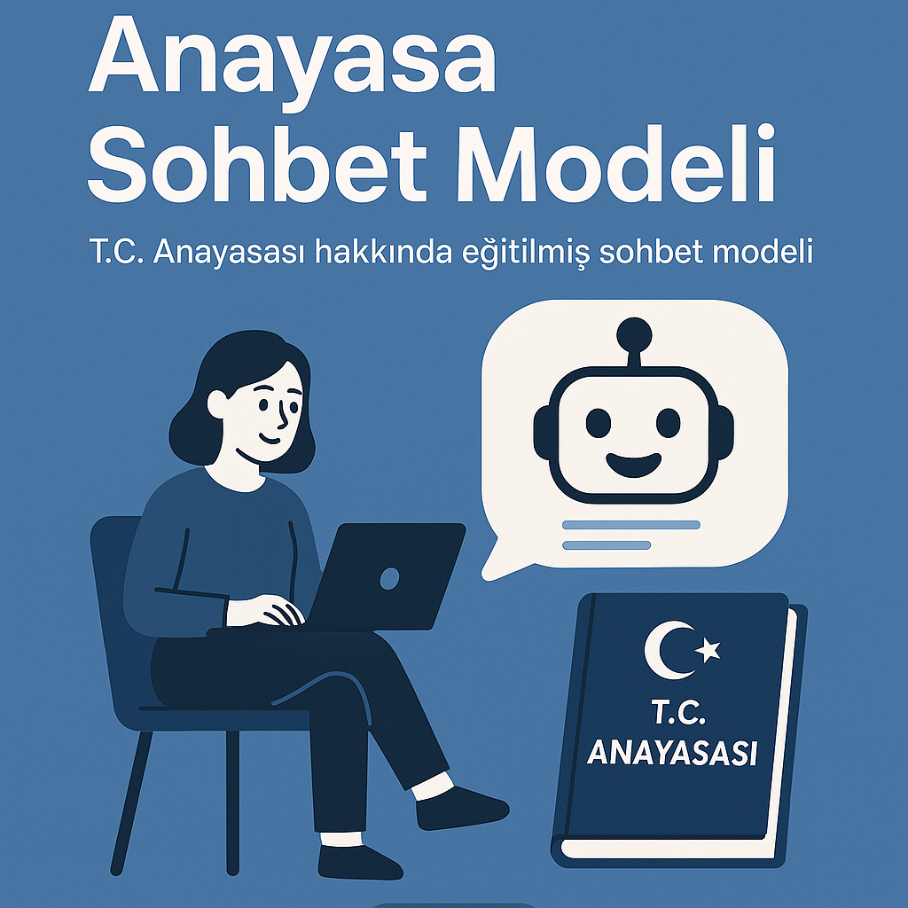
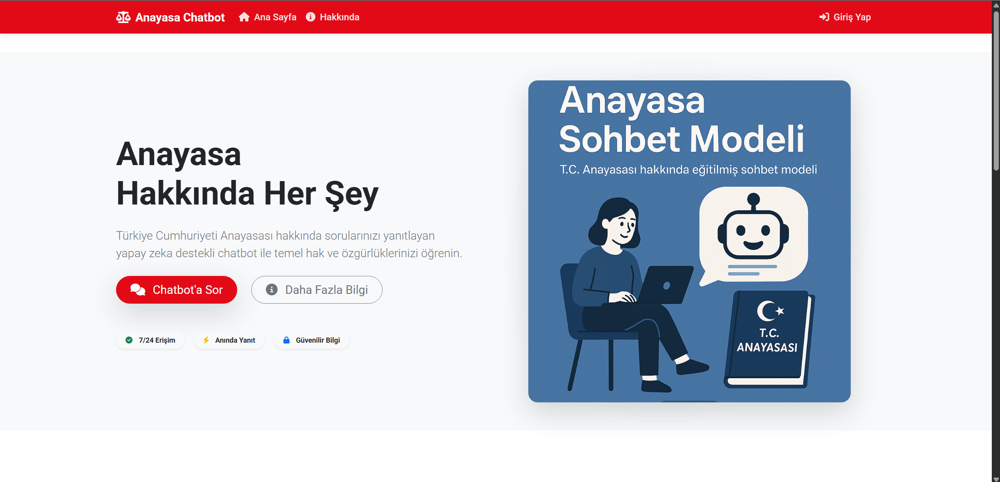
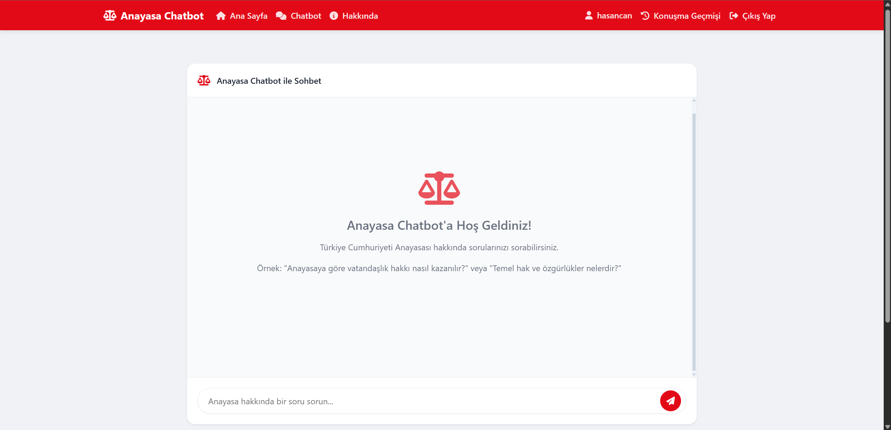
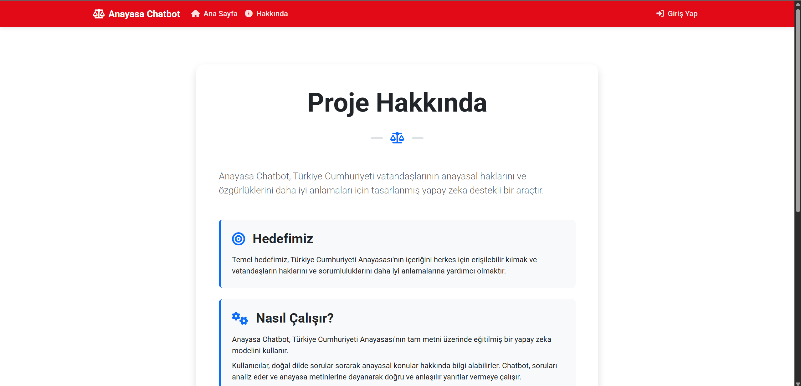
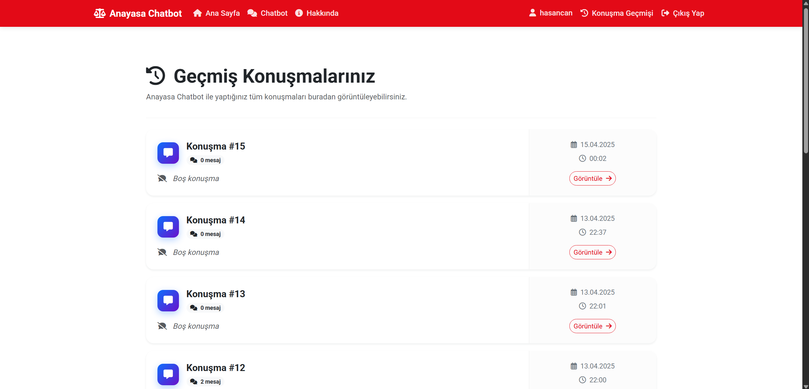
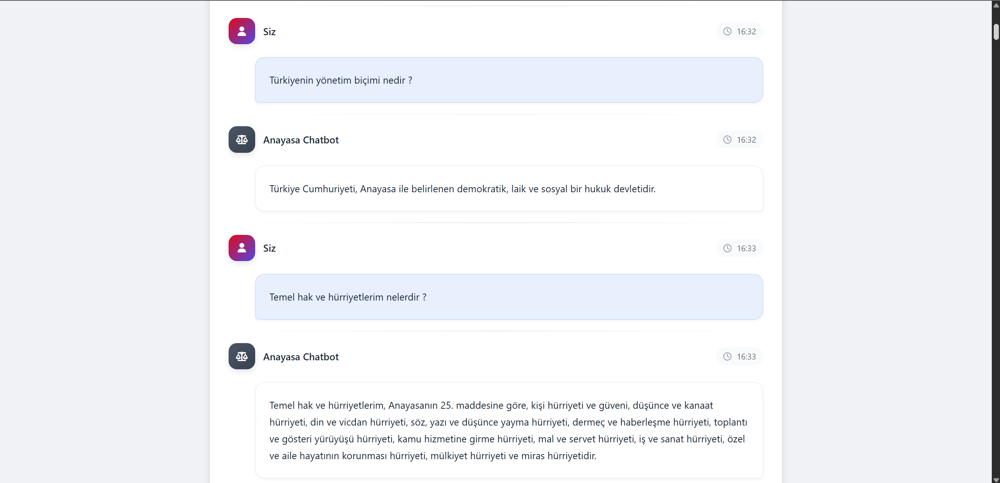
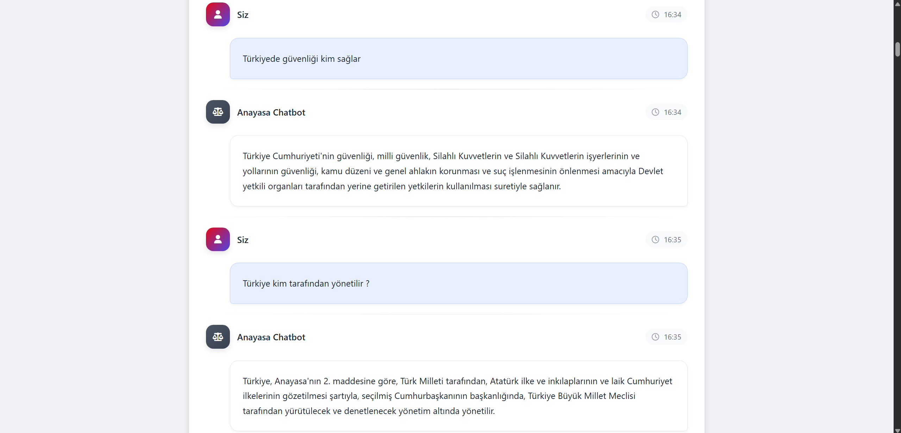
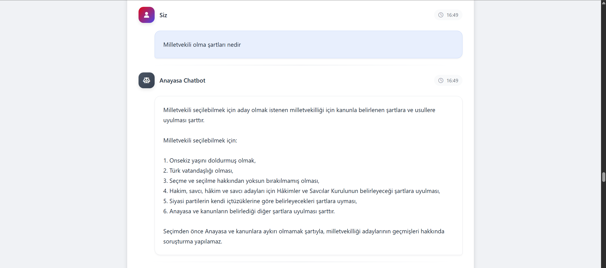
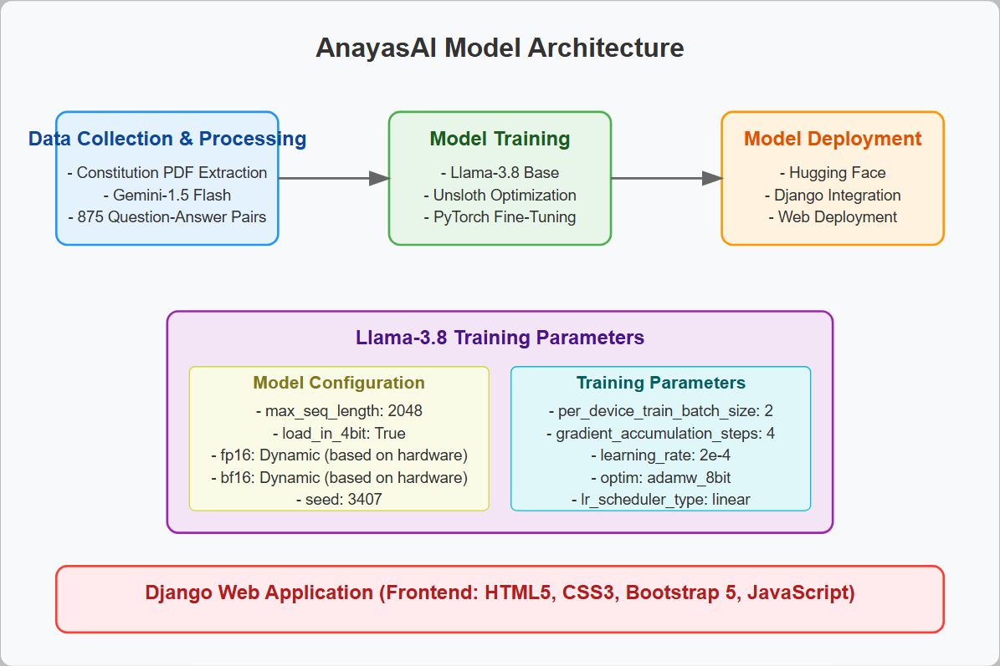

# Constitution Chatbot

  <!-- Add an image relevant to your project -->

## 📑 About the Project

Constitution Chatbot is an artificial intelligence-based question-answer system trained on the Constitution of the Republic of Turkey. This project was developed so that citizens can easily learn their constitutional rights and state structure. Using a dataset of 875 questions and answers created with the Gemini-1.5 Flash model, the Llama-3.8 model was fine-tuned and made available to everyone with a comprehensive Django web application.

## 🌟 Features

- **Constitution Expert Chatbot**: Customized AI model that can answer your questions about the Constitution of the Republic of Turkey
- **User Account System**: Registration and login system for secure access
- **Conversation History**: Ability to view users' previous chats
- **Responsive Design**: Interface usable on all screen sizes, including mobile devices
- **Fast and Accurate Answers**: Optimized performance with finetuned version of Llama-3.8 model


## 🔧 Technologies

### Model Training
- **Data Collection and Processing**: PyPDF2, Pandas, CSV
- **Model Training**:
- Gemini-1.5 Flash (dataset creation)
- Llama-3.8 (fine-tuning)
- Unsloth (optimization)
- PyTorch

### Web Application
- **Backend**: Django
- **Frontend**: HTML5, CSS3, Bootstrap 5, JavaScript
- **Database**: SQLite/PostgreSQL
- **Deployment**: Hugging Face Model Hosting

## 🚀 Installation

### Requirements
- Python 3.8+
- Django 4.0+
- PyTorch
- Unsloth
- Hugging Face Transformers

## 📊 Dataset Creation Process

The dataset used in this project includes 875 question-answer pairs extracted from the Constitution of the Republic of Turkey. Dataset creation process:

1. Constitution text extracted from PDF
2. Question-answer pairs created using Gemini-1.5 Flash model
3. Data cleaning and normalization processes applied
4. Prepared for fine-tuning to Llama-3.8 model

Some topics covered in the dataset:
- Fundamental rights and freedoms
- Legislative, executive and judicial
- Constitutional amendments
- Citizenship rights
- State structure

## 👥 User Interface

The web application includes the following pages:
- **Homepage**: Project introduction and features
- **Chatbot Page**: Area for interaction with AI
- **About Me**: Project and developer information
- **Register/Login**: User account management
- **Conversation History**: View previous chats
- **Conversation History**: View conversation details

## 🖼️ Project Screenshots

### 🏠 Homepage


### 🏠 Chatbot Page


### 🏠 About Me


### 🏠 Conversation History


### 🏠 Conversation Detail






## Model Architecture



## 🤖 Using the Model

You can use the trained model directly from Hugging Face:

```python
max_seq_length = 2048
dtype = None
load_in_4bit = True

if True:
    from unsloth import FastLanguageModel
    model, tokenizer = FastLanguageModel.from_pretrained(
        model_name="HasanCan6241/anayasa-lora-Llama-3.8",
        load_in_4bit=load_in_4bit,
        dtype=dtype,
        max_seq_length=max_seq_length,
    )
    FastLanguageModel.for_inference(model)

messages = [
    {"role": "user", "content": "Anayasaya göre en temel hak ve hürriyetlerim nelerdir?"}
]

input_ids = tokenizer.apply_chat_template(
    messages, add_generation_prompt=True, return_tensors="pt"
).to("cuda")

from transformers import TextStreamer
text_streamer = TextStreamer(tokenizer, skip_prompt=True)

outputs = model.generate(
    input_ids,
    streamer=text_streamer,
    max_new_tokens=256,
    pad_token_id=tokenizer.eos_token_id
)
```
Click here to access the [model](https://huggingface.co/HasanCan6241/anayasa-lora-Llama-3.8)

### Adımlar

1. Repoyu klonlayın:
```bash
git clone https://github.com/HasanCan6241/ConstituAI.git
cd anayasa-chatbot
```

2. Virtual environment oluşturun ve aktif edin:
```bash
python -m venv venv
source venv/bin/activate  # Linux/Mac
venv\Scripts\activate     # Windows
```

3. Gerekli paketleri yükleyin:
```bash
pip install -r requirements.txt
```

4. Veritabanı migrasyonlarını yapın:
```bash
python manage.py migrate
```

5. Projeyi çalıştırın:
```bash
python manage.py runserver
```

6. You can start using the application by going to `http://localhost:8000` in your browser.

## 📝 Lisans

This project is licensed under the [MIT License](LICENSE).
---

⭐ If you like this project, don't forget to star it!
